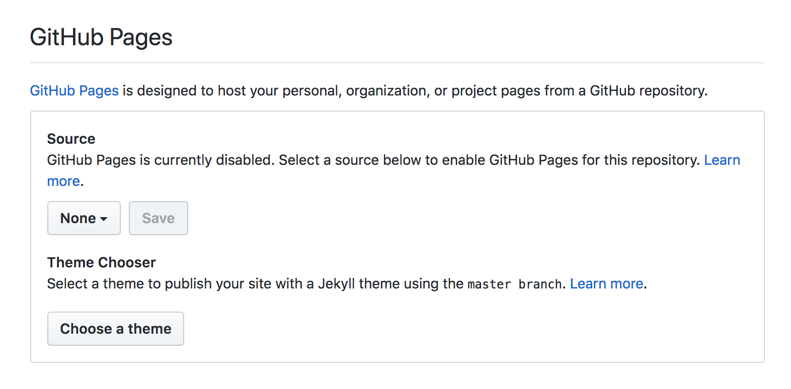
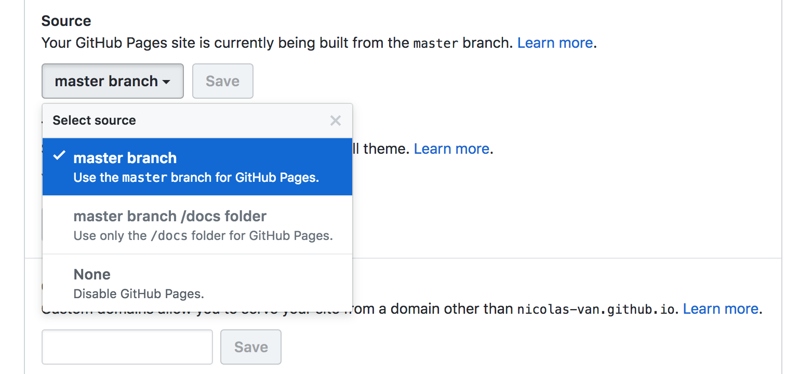

# living room


# boiler

## electric

https://www.selcobw.com/products/plumbing-heating/heating/boilers/vokera-easi-heat-29kw-combi-boiler-flue
https://e-metalowiec.com/podgrzewacze-elektryczne/1572-przeplywowy-ogrzewacz-wody-siemens-dh24400-24-kw-wysylka-gratis--4242003324097.html

# paint

dulux polączyć z wapnem
nie latexowe

# ground room floor

real wood
https://www.diy.com/departments/colours-rondo-natural-oak-solid-wood-flooring-1-3m-/1650211_BQ.prd
kuchnia 120cm płytki, są listwy do połączenia drewna i płytek, listy nakładkowe

laminate
https://www.selcobw.com/products/flooring-tiling/flooring/laminate/krono-8mm-v-groove-laminate-flooring-vario-rockford-oak-effect-2-22m

# bathroom

drewno sie zrywa, na to sklejka wodoodporna, na to płytki na klej plastyczny

# upstairs bedroom

https://www.diy.com/departments/holden-d-cor-teal-animals-glitter-wallpaper/1927410_BQ.prd
https://www.diy.com/departments/peyote-cartoon-foxes-wallpaper/3663602561569_BQ.prd/gallery

# Easy Markdown to Github Pages

## Introduction

This little guide demonstrate how to turn any [Github](http://github.com) repository with a bunch of [Markdown](https://en.wikipedia.org/wiki/Markdown) files into a simple website using [Github Pages](https://pages.github.com/) and [Jekyll](https://jekyllrb.com/).

* You don't need to use the command line or anything other than your browser.
* It doesn't require any knowledge in Jekyll.
* It's completely compatible with any bunch of markdown files you already have in any existing repository without any modification to those files. That includes the basic `README.md` almost all repositories contain.
* The markdown files will remain just as readable and usable in Github than in your website.

In fact this guide uses the same configuration and can be read both in Github and in Github Pages, at your preference:

* [Here is the link to the Github version](https://github.com/nicolas-van/easy-markdown-to-github-pages)
* [Here is the link to the Github Pages version](https://nicolas-van.github.io/easy-markdown-to-github-pages/)

## Step by step instructions

### Determine the repository where you want to activate Github Pages

You can of course create a new repository if you want.

### Create the `_config.yml` file

That file should be created on the root of your repository. Here is some content to copy-paste in it:

```
plugins:
  - jekyll-relative-links
relative_links:
  enabled: true
  collections: true
include:
  - CONTRIBUTING.md
  - README.md
  - LICENSE.md
  - COPYING.md
  - CODE_OF_CONDUCT.md
  - CONTRIBUTING.md
  - ISSUE_TEMPLATE.md
  - PULL_REQUEST_TEMPLATE.md
```

It's basically just a few tuning of Github Pages' default configuration to have a better handling of Markdown files.

### Activate Github Pages in your repository configuration

On the Github page of your project go into `Settings > Options > Github Pages`:



In the `Source` option, select `master branch` then `Save`:



You must also choose a theme:


That's it! Now you can juste use the link provided by Github to access you website:


## Usage guide

* Any markdown file in your repository will display in your Github Pages website. You just have to use the same path to access it and replace the `.md` extension by `.html`.
* To make links between your Markdown files just use a relative path to the other Markdown file. The configuration you copy pasted in your `_config.yml` provides a plugin to convert those URLs. So your Markdown files will have correct links both in Github and Github Pages.
* The index page of your website can be a `index.md` file or a `README.md` file. If both exists the `index.md` file has priority.
* You should be able to use any [Github Flavored Markdown](https://guides.github.com/features/mastering-markdown/).

## Known differences between Github and Github Pages

* No automatic links with Github Pages. The Github Markdown renderer can automatically detect a simple copy-pasted link and make it a clickable link. Github Pages doesn't propose a feature to reproduce that behavior, so you'll have to braces your links with the `[]()` syntax.

## Recipes

Since the purpose of this guide is to demonstrate how to publish multiple Markdown files as a website but I don't have much more to say I will propose you some delicious recipes instead:

* [Escalivada](./recipes/Escalivada.md)
* [Gazpacho](./recipes/Gazpacho.md)
* [Pasta all'amatriciana](./recipes/Pasta_all_amatriciana.md)

## Contributing

See the [Contribution Guide](./CONTRIBUTING.md).

## License

See the [License File](./LICENSE.md).
